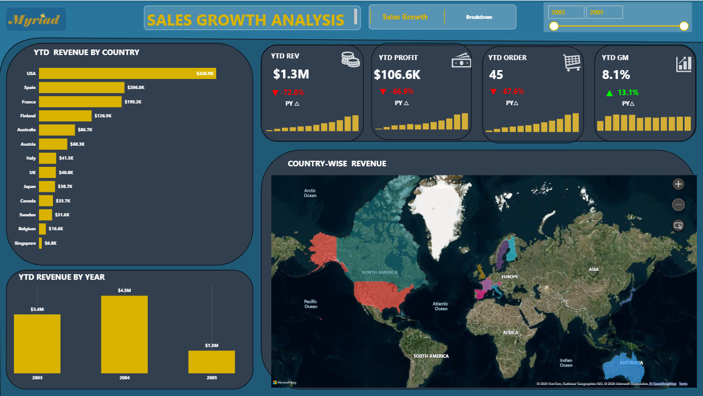

# 🚀Sales-Growth-Analysis-Dashboard-Power-BI
## 📘 Overview

This project presents a two-page Power BI dashboard for Sales Growth Analysis, designed to provide executives with a dynamic view of company performance, profitability, and market trends.

It evaluates year-to-date (YTD) sales, profit, and order performance while offering a geographical breakdown across multiple countries.
The dashboard supports data-driven business growth decisions through automated visuals, DAX-powered KPIs, and comparative insights.

>This Power BI dashboard analyzes company sales performance based on shipped orders only, providing a clear picture of realized revenue and profitability across products, time, and countries.
It excludes pending, canceled, or returned orders to ensure accurate business insights from completed transactions.

# Data Source and Modelling

Data source: ('https://www.kaggle.com/datasets/kyanyoga/sample-sales-data/data')
File name: Sample Sales Data

# 🧩 Data Modelling

The dataset contains 25 columns in a single flat table. To enhance performance and analytical efficiency, the data was modelled into a star schema with clearly defined fact and dimension tables.

Since the original dataset did not include a cost price column, I created a calculated column to estimate cost.
For this analysis, the hypothetical cost price was assumed to be 7% lower than the Manufacturer’s Suggested Retail Price (MSRP), providing a realistic basis for profit margin calculations.

# 🎯 Objectives

- Evaluate YTD performance against the previous year (PY) using dynamic KPIs.

- Analyze monthly trends for revenue and profit growth.

- Identify top-performing countries and product categories.

- Detect underperforming areas and opportunities for improvement.

- Deliver interactive filtering and real-time data visualization.

## 🗂️ Dashboard Structure
Page 1: Sales Growth Overview

>This page focuses on overall business performance metrics:

- 🪙 Total Revenue — $9.29M overall company sales.

#  📈 YTD Revenue & Profit Trends — Monthly growth visualization for the current year.

 # KPIs Summary:

- YTD Revenue: $1.3M  and -72% YoY

- YTD Profit: $106.6K and  -66.9% YoY

- YTD Orders: 45 and -67.6% YoY

- YTD Gross Margin: 8.1% and +13.1% YoY

-  Product-Level Analysis

- “Vintage Cars” and “Classic Cars” dominate overall revenue.

- “Motorcycles” and “Ships” also contribute solid profit margins.

- All product categories show declining YoY revenue, signaling potential demand slowdowns.

# Regional & Yearly Breakdown
>This page highlights regional and country-wise sales distribution:

# 🌍 YTD Revenue by Country:

- USA leads with $427K, followed by Spain ($206K) and France ($199K).

- Emerging markets such as Singapore and Belgium show limited contribution (<$30K).

# 📊 YTD Revenue by Year:

- 2004 shows a peak at $4.5M, followed by declines in 2005 (−72%).

#  Country-wise Revenue Map:

Interactive map visualization showcasing revenue distribution by continent and country, aiding quick geographic comparisons.

# 📊 Key Insights

- USA, Spain, and France drive majority of global sales, contributing nearly 70% of total YTD revenue.

- Profit margins have improved YoY despite a -72% revenue decline, indicating cost reduction success.

- Seasonality: Q4 months (Oct–Dec) consistently outperform other months.

- Geographical imbalance: Certain countries show underutilized potential, suggesting a need for targeted sales campaigns.

# Tools & Technologies

Power BI Desktop — Dashboard design, DAX calculations, and report building.

Power Query — Data cleaning and transformation.

DAX (Data Analysis Expressions) — KPI creation and time intelligence.

CSV Data Source — Raw transactional dataset.
